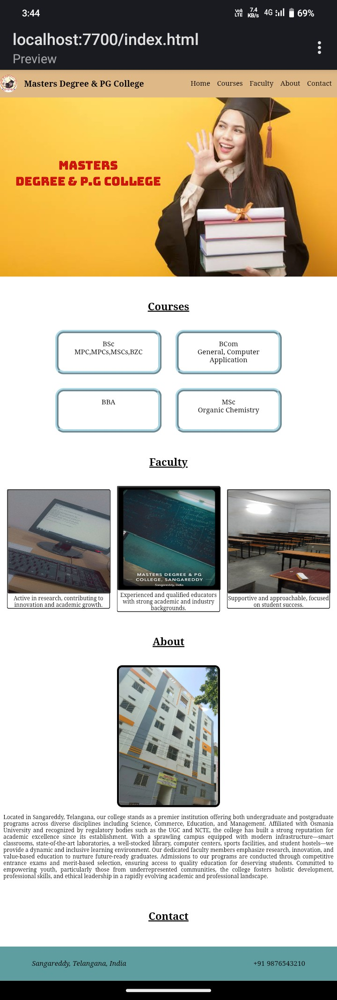

<h1>College Website 🌐</h1>

  This project was created as a part of my learning journey to practice front-end web development. It reflects a real-world application of HTML and CSS in building a structured, presentable, and responsive college website layout.

## 📁 Features
<ul>
<li>Homepage – Welcome section with college name.</li>

<li>Faculty – Details of college faculty members</li>

<li>Courses – Information on various courses offered</li>

<li>Contact – College contact details and inquiry options</li>

<li>Smooth Navigation – Simple anchor-based navigation between sections.</li>
</ul>

## 💻 Technologies Used

> HTML5 – For structure and content.
> CSS3 – For styling and layout

## 🔗 Navigation
  The entire website is navigable through anchor links, enabling smooth scrolling or jumping to different sections on the same page.

## 📸 Preview

## 📂 How to Use
1. Clone this repository:
git clone https://github.com/yourusername/college-website.git
2. Open index.html in any web browser.
3. Browse through the site sections.

## <h3>Author - Shravani Thouta </h3>
